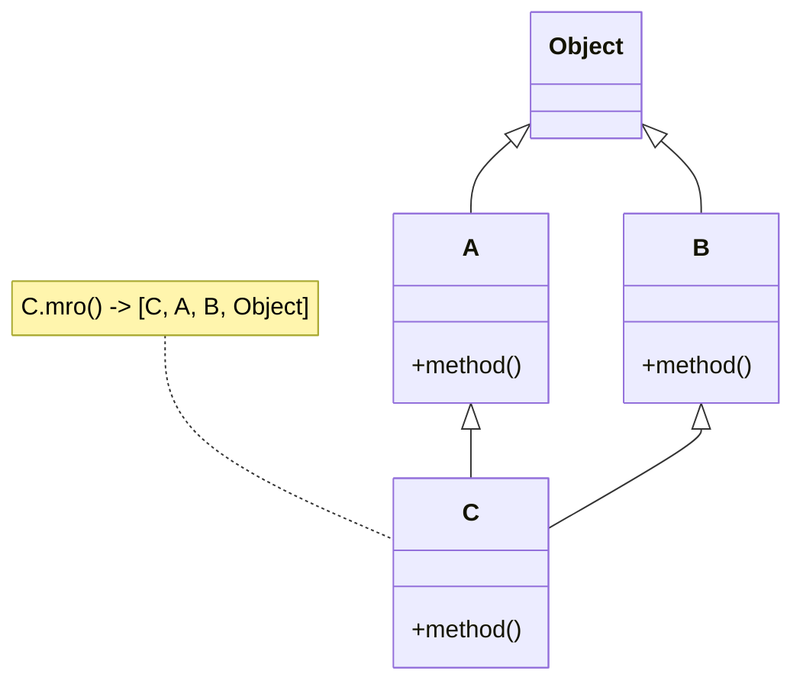
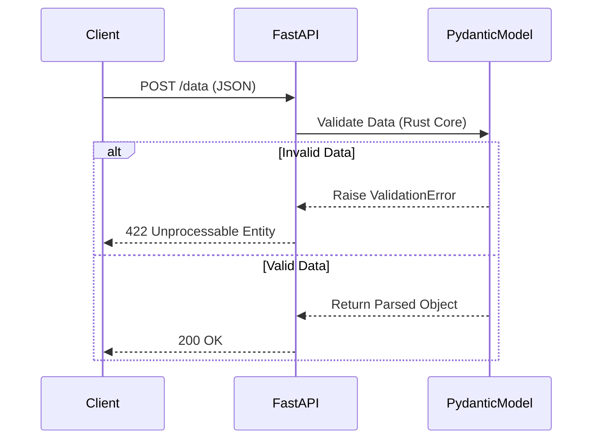
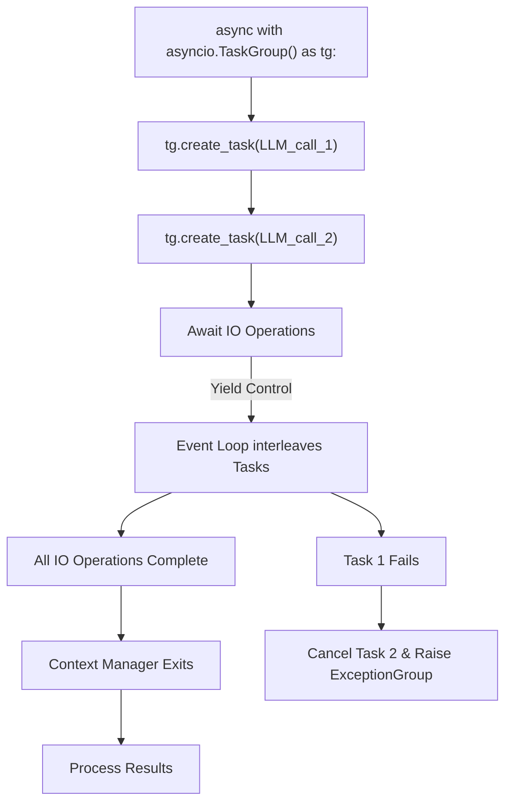
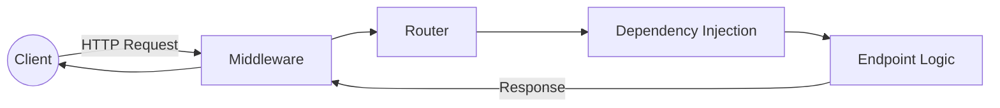

# Module 1: Python Fundamentals & Backend Mastery

This module is designed to transition you from standard Python scripting to **expert-level production engineering**. It covers the deep internals of Python (up to Python 3.12+), asynchronous programming, robust API development, and rigorous data validation techniques crucial for AI backend systems.

## 📂 Curriculum Structure & Detailed Syllabus

### `01_python_core/`
*Deep dive into Python's execution model and memory architecture.*
- **Memory Management:** Reference counting, Garbage collection (cycles), `sys.getrefcount`.
- **The Python Data Model:** Under the hood of Python objects. Understanding `__slots__` for memory optimization, `__getattribute__` vs `__getattr__`, and object hashing (`__hash__`, `__eq__`).
- **Control Flow:** Structural Pattern Matching (PEP 634 - `match/case` with destructuring, guards, and OR patterns).
- **Context Managers:** Implementing `__enter__`/`__exit__`, `contextlib.contextmanager`, `AsyncContextManager` (`__aenter__`/`__aexit__`).
- **Advanced Strings:** F-string improvements (PEP 701 - nested quotes, multi-line), Arbitrary Literal String Types (PEP 675) for preventing prompt/SQL injection.

### `02_advanced_functions/`
*Mastering functional programming paradigms in Python.*
- **First-class functions & Closures:** Late binding closures, `nonlocal` keyword.
- **Advanced Decorators:** Decorators with arguments, class decorators, `functools.wraps`, preserving signatures.
- **Generators & Coroutines:** Generator expressions, `yield from`, sending data to generators (`generator.send()`), lazy evaluation for processing massive datasets out-of-memory.
- **Higher-order functions:** `map`, `filter`, `reduce`, `functools.partial`.

### `03_advanced_oop/`
*Engineering robust, scalable class architectures.*
- **Descriptor Protocol:** Building custom properties via `__get__`, `__set__`, and `__delete__`.
- **Multiple Inheritance:** Method Resolution Order (MRO), the C3 Linearization algorithm, and `super()`.
- **Metaclasses:** Class creation hooks (`__new__`, `__init_subclass__`), modifying class dictionaries at creation time.
- **Modern Classes:** `dataclasses` (frozen, `field` configurations, `__post_init__`) vs `attrs` vs traditional classes.

#### Concept: Method Resolution Order (MRO)

### `04_type_safety_and_pydantic/`
*Strict typing for mission-critical AI applications.*
- **Modern Python Typing (3.11/3.12):** New Type Parameter Syntax (PEP 695: `class Box[T]:`), `@override` (PEP 698), `Self` type (PEP 673), Variadic Generics (`TypeVarTuple`).
- **Advanced Typing Constructs:** `Protocol` (Structural subtyping/Duck typing), `Callable`, `ParamSpec` (for typing decorators), `TypedDict` with `Unpack` (`**kwargs` typing).
- **Static Analysis:** Integrating `mypy` and `pyright` into CI pipelines.
- **Pydantic V2 (Rust-core):** `BaseModel`, `Field` validators, `model_validator` (mode='before' vs 'after'), discriminated unions for complex AI JSON responses.

#### Concept: Pydantic Validation Lifecycle

### `05_concurrency_and_asyncio/`
*Mastering non-blocking I/O for scalable LLM API orchestration.*
- **The Global Interpreter Lock (GIL):** What it is, why it exists, and the PEP 703 (No-GIL) future. CPU-bound vs I/O-bound bottlenecks.
- **Threading & Multiprocessing:** `ThreadPoolExecutor`, `ProcessPoolExecutor`, memory sharing via IPC.
- **`asyncio` Internals:** The Event Loop, Tasks, Futures, Coroutines.
- **Modern Concurrency (3.11+):** `asyncio.TaskGroup` for structured concurrency, Exception Groups (`ExceptionGroup` and `except*` syntax) for catching concurrent errors.
- **Concurrency in AI:** Throttling API requests with `asyncio.Semaphore`, timeouts, handling rate limits cleanly.

#### Concept: Asyncio TaskGroup Lifecycle

### `06_fastapi_backend/`
*Building the API gateway for AI models.*
- **Core FastAPI:** `APIRouter`, path/query parameter validation, OpenAPI schema generation.
- **Dependency Injection:** Building modular endpoints using `Depends`, class-based dependencies, and `yield` dependencies (e.g., DB session generators).
- **Middlewares & Starlette:** Custom middlewares, CORS, managing request/response lifecycles, Background Tasks for non-blocking model inference.
- **Real-Time Streaming:** Implementing Server-Sent Events (SSE) for streaming LLM tokens, WebSockets for bi-directional agentic communication.

#### Concept: FastAPI Request Lifecycle

### `07_database_and_sqlalchemy/`
*Persisting AI agent state and user data.*
- **Async SQLAlchemy 2.0:** Modern `select` constructs, `AsyncSession`, connection string configuration.
- **Bridging ORMs:** Converting SQLAlchemy models to Pydantic responses securely (ORM mode).
- **Alembic:** Managing asynchronous database migrations.
- **Performance:** Connection pooling strategies (e.g., PgBouncer interaction), preventing the N+1 query problem using `joinedload` and `selectinload`.

### `08_testing_and_profiling/`
*Ensuring production reliability.*
- **Testing (`pytest`):** Advanced fixtures (`autouse`, scopes), parameterization, `pytest-asyncio` for async endpoints.
- **Mocking:** `unittest.mock.patch`, mocking external LLM API calls with `respx` or `pytest-httpx` to save costs and run CI offline.
- **Performance Profiling:** Identifying CPU bottlenecks with `cProfile` and `py-spy`, detecting memory leaks with `memory_profiler`.

---

## 🎯 How to Progress
1. Create a `concept_notes.md` or `.ipynb` inside each folder as you learn the theory.
2. Build standalone practice scripts (`practice.py`) to test the concepts.
3. Once comfortable, move to the next folder. Do not proceed to Module 2 until you have mastered these concepts.
