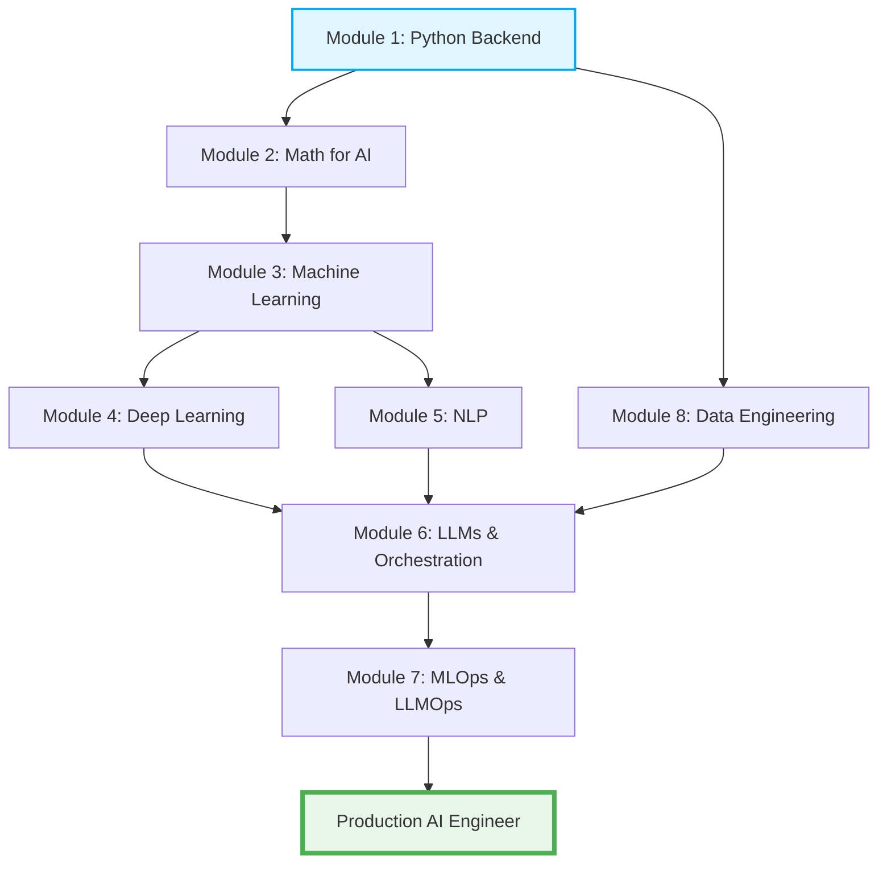
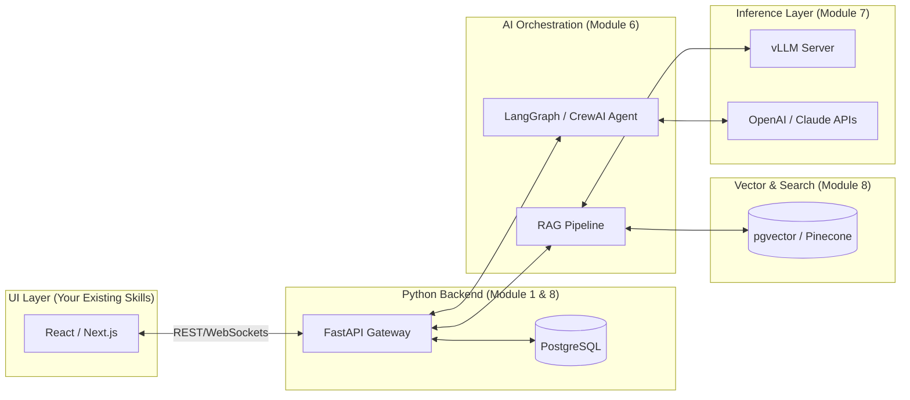

# Python Backend & AI Engineer Learning Roadmap (2026 Edition)

## Overview
A comprehensive roadmap specifically tailored for an experienced frontend developer transitioning into a **Python Backend + AI Engineer** role. This path skips frontend technologies (JS/TS) and dives deep into production-grade Python backend development, advanced AI model orchestration, and MLOps/LLMOps.

### Learning Path Flow

---

## Module 1: Python Fundamentals & Backend Mastery

### Basic Topics
- **Core Syntax:** Variables, Data Types, Control Flow, Functions
- **Data Structures:** Lists, Tuples, Sets, Dictionaries
- **Advanced Python Constructs:** Decorators, Generators, Iterators, Context Managers

### Intermediate Topics (Production Python)
- **Object-Oriented Programming (OOP):** Classes, Inheritance, Dunder Methods, Metaprogramming
- **Type Safety & Validation:** **Pydantic** (V2), Python Type Hints (`typing`), Data validation patterns
- **Concurrency & Parallelism:** `asyncio` (Crucial for high-concurrency LLM API calls), Multithreading, Multiprocessing
- **Modern Tooling:** `uv` or `pip` for dependency management, `pytest` for testing, `ruff` for linting/formatting

### Advanced Topics (Backend Engineering)
- **API Development:** **FastAPI** (The industry standard for AI backends), RESTful APIs, GraphQL basics
- **Database Integration:** SQLAlchemy 2.0 (Async), Alembic (Migrations), integrating PostgreSQL
- **Security & Authentication:** OAuth2, JWT tokens, API Rate Limiting

---

## Module 2: Math for AI (Targeted)

### Linear Algebra & Calculus
- **Basic to Intermediate:** Vectors, Matrices, Matrix Operations, Derivatives, Gradients
- **Advanced:** Eigenvectors, Singular Value Decomposition (SVD), Hessian matrices (Understanding how backprop and embeddings work mathematically)

### Probability & Statistics
- **Basic to Intermediate:** Distributions, Expected value, Variance
- **Advanced:** Bayes' Theorem, Hypothesis testing (A/B testing for model variants)

---

## Module 3: Machine Learning (Foundational)

### Core ML
- **Basic:** Linear/Logistic Regression, K-NN
- **Intermediate:** Decision Trees, Support Vector Machines (SVM), Scikit-learn basics
- **Advanced:** Gradient Boosting (XGBoost, LightGBM), Hyperparameter Tuning, Model Evaluation Metrics (ROC-AUC, Log Loss)

### Unsupervised Learning
- **Basic to Intermediate:** K-Means Clustering, DBSCAN, Principal Component Analysis (PCA)
- **Advanced:** t-SNE, UMAP (for visualizing high-dimensional vector embeddings)

---

## Module 4: Deep Learning Frameworks

### Core Deep Learning
- **Basic:** MLPs, Activation Functions, Forward/Backward Propagation
- **Intermediate:** Loss Functions, Optimizers (Adam, AdamW), Regularization (Dropout)

### AI Frameworks (Industry Standard)
- **PyTorch:** Tensors, Autograd, Custom Datasets, Training loops, Saving/Loading models (The de-facto standard for AI Engineering)
- **Hugging Face:** `transformers` library, tokenizers, working with open-weight models

### Computer Vision & Sequences (Optional but useful)
- **Intermediate:** CNNs (ResNet), RNNs/LSTMs
- **Advanced:** Vision-Language Models (VLMs), embeddings for multimodal data

---

## Module 5: NLP (Natural Language Processing)

### Text Processing & Representation
- **Basic:** Tokenization, Stemming, Lemmatization
- **Intermediate:** TF-IDF, N-grams
- **Advanced:** Dense Word Embeddings (Word2Vec, FastText), Subword Tokenization (BPE)

### NLP Tasks
- **Basic to Intermediate:** Text Classification, Sentiment Analysis, Named Entity Recognition (NER)
- **Advanced:** Transformer basics, Self-Attention mechanism

---

## Module 6: LLMs, Generative AI & Orchestration

### LLM Fundamentals
- **Basic:** Transformer Architectures (BERT vs. GPT vs. T5)
- **Intermediate:** Prompt Engineering, Few-Shot Learning, Function Calling / Tool Use
- **Advanced:** Fine-Tuning (SFT), Parameter-Efficient Fine-Tuning (PEFT, LoRA, QLoRA), Custom model evaluation

### RAG (Retrieval-Augmented Generation)
- **Basic:** Embedding generation (OpenAI, BAAI/bge), Semantic search
- **Intermediate:** Naive RAG, Chunking strategies, LangChain, LlamaIndex
- **Advanced:** Advanced RAG (Re-ranking, HyDE, Parent-Document Retrieval, GraphRAG)

### Agentic Systems & Orchestration
- **Intermediate:** Designing Multi-step AI workflows, LLM state management
- **Advanced:** **LangGraph**, **CrewAI**, **Model Context Protocol (MCP)** servers, Autonomous AI Agents that interact with your FastAPI backend

---

## Module 7: MLOps & LLMOps (Production Readiness)

### Containerization & CI/CD
- **Basic:** Git, GitHub Actions
- **Intermediate:** **Docker**, writing optimized Dockerfiles for ML environments
- **Advanced:** Multi-stage builds, CI/CD pipelines for model testing

### Model Serving & Inference
- **Intermediate:** Exposing models via FastAPI
- **Advanced:** High-throughput inference engines (**vLLM**, Triton Inference Server, TGI), Token streaming, Request batching

### Observability & Registry
- **Intermediate:** MLflow, Weights & Biases (W&B)
- **Advanced:** Prometheus & Grafana for API monitoring, Tracing LLM calls (LangSmith, Phoenix), detecting Data/Concept Drift

### Orchestration
- **Advanced:** **Kubernetes (K8s)** basics for scaling ML workloads, Kubeflow

---

## Module 8: Data Engineering & Vector Databases

### Databases & Storage
- **Basic:** PostgreSQL fundamentals
- **Intermediate:** Data Warehouses, Object Storage (S3)
- **Advanced:** **Vector Databases** (Pinecone, Qdrant, Weaviate, Milvus, `pgvector`), HNSW indexing

### Data Pipelines
- **Intermediate:** ETL/ELT basics
- **Advanced:** Apache Airflow, Prefect, building scalable data pipelines for continuous model training

### Feature Stores
- **Advanced:** Feast, Hopsworks, managing offline vs. online feature serving

---

## 🚀 Recommended Capstone Projects (Backend + AI Integration)

### Target Architecture (Connecting UI to AI Backend)

1. **Production RAG API:** Build a FastAPI backend connected to `pgvector`. Implement Advanced RAG using LangGraph, including document parsing, chunking, and semantic search.
2. **Autonomous Agent with MCP:** Create an AI Agent that can securely query a SQL database and execute Python scripts using the Model Context Protocol (MCP), wrapped in a Dockerized environment.
3. **High-Throughput LLM Server:** Deploy an open-source model (like Llama 3) using vLLM on a cloud GPU instance. Put a FastAPI gateway in front of it to handle authentication and rate-limiting, and monitor it with Prometheus/Grafana.
