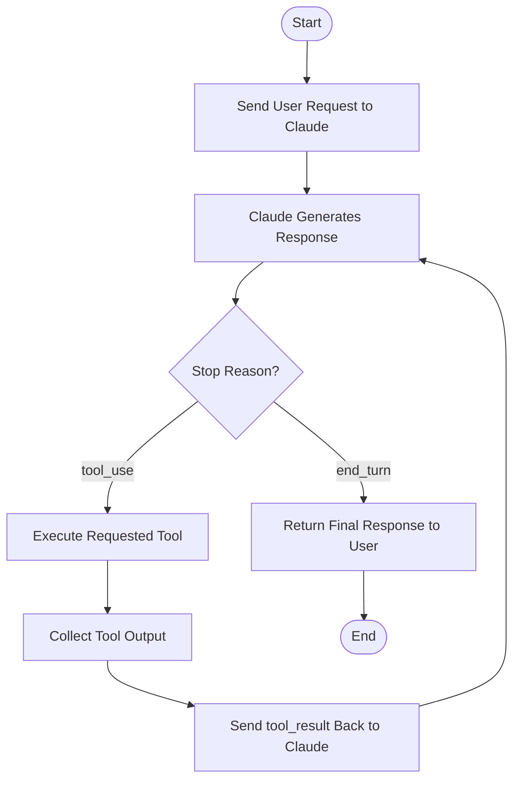
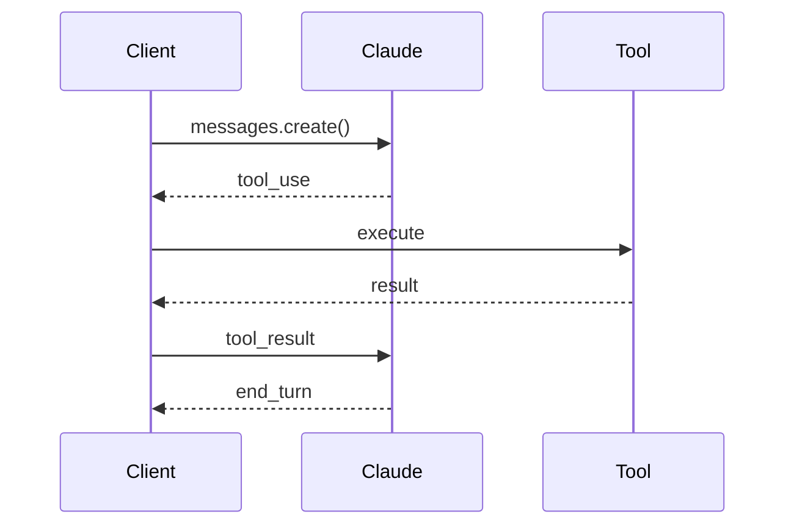
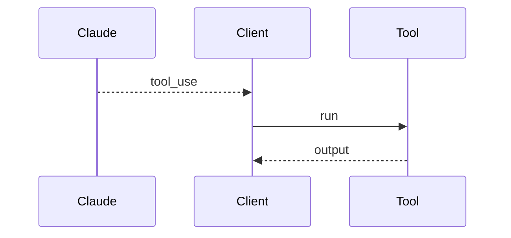
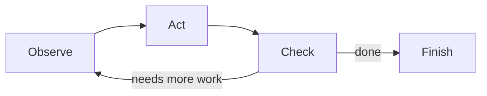
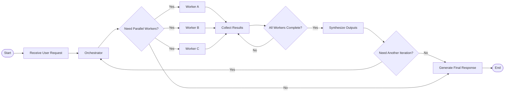

# Module 1: Agentic Architecture & Orchestration

This module is about choosing the right control flow for Claude turn handling and multi-agent work. The core question is not "can the model answer?" but "what orchestration shape keeps the system reliable when tools, retries, and delegation enter the loop?"

## Anti-patterns to avoid

- `stop_reason` ignored: this usually turns a well-defined turn lifecycle into guesswork.
- text parsing instead of `stop_reason`: brittle, expensive to maintain, and easy to break with model phrasing changes.
- monolithic agent: looks simpler at first, but collapses under heterogeneous tasks.
- wrong orchestration shape: the agent graph does not match the work decomposition.
- missing error propagation: failures disappear and the caller cannot recover correctly.
- shared context between subagents: creates leakage, interference, and hidden coupling.
- vague tool boundaries: tools become ambiguous and harder to route or test.
- synthesis inside the wrong agent: the agent with incomplete context pretends to be the final judge.

## Pattern tradeoffs

- branch on `stop_reason`: gives explicit control over when to continue, stop, or hand off.
- loop back on `tool_use`: keeps the agent in a real interaction loop instead of a one-shot prompt.
- return `tool_result`: preserves a structured contract between caller and tool.
- specialized agents: improves focus and local correctness, at the cost of more coordination.
- hub-and-spoke: centralizes policy while keeping task execution distributed.
- sequential pipelines: good when outputs are inputs, but they can overconstrain exploratory work.
- task decomposition: reduces complexity, but only when the decomposition is faithful to the task.
- structured findings: makes downstream consumption and validation easier.
- orchestrator-worker: strong for routing and aggregation, weaker if the orchestrator becomes a bottleneck.
- evaluator-optimizer: useful for iterative refinement, but expensive if used everywhere.
- routing: directs work to the best handler, but requires good classification signals.
- parallelization: cuts latency on independent branches, but increases merge complexity.
- fallback paths: improve resilience, but can hide repeated upstream failures if overused.

## Topic notes

### Claude turn lifecycle
- **What it is:** The structured lifecycle of one Claude interaction, from request to response, tool calls, tool results, and final stop condition.
- **When to use:** Use it when deciding whether the client should continue, stop, execute tools, retry, or escalate.

- **Pros:** Gives you a disciplined mental model for when the model is speaking, when tools are active, and when the turn is complete. This is the base layer for every reliable client loop.
- **Cons:** Easy to oversimplify into "send prompt, read text." Once you do that, you miss the state transitions that matter in production.

### Messages API turn flow
- **What it is:** The Messages API protocol for sending conversation state to Claude and interpreting structured response content and stop reasons.
- **When to use:** Use it when the question is about API control flow, structured responses, or stop reasons.

- **Pros:** Makes the control protocol explicit and lets clients react to structured turn events instead of free-form text.
- **Cons:** Requires you to implement the protocol faithfully. If your client is lazy here, every later abstraction inherits the mistake.

### `tool_use` blocks
- **What it is:** Structured content blocks where Claude asks the caller to execute a named tool with specific inputs.
- **When to use:** Use it when a scenario involves tool_use blocks and asks which mechanism, scope, boundary, or reliability pattern fits.

- **Pros:** They are the cleanest signal that the model is delegating work outward. That gives the client a precise trigger for tool execution.
- **Cons:** If you treat them as text, or let tools drift into fuzzy prompts, the orchestration boundary collapses.

### `tool_result` blocks
- **What it is:** Structured content blocks sent back to Claude with the result of a previously requested tool call.
- **When to use:** Use it when a scenario involves tool_result blocks and asks which mechanism, scope, boundary, or reliability pattern fits.
- **Pros:** Preserve provenance and make it obvious what came back from a tool versus the model itself.
- **Cons:** If the tool output is unstructured or noisy, the model still has to do extra work to interpret it.

### `end_turn`
- **What it is:** A stop reason indicating Claude has completed its response for the current turn.
- **When to use:** Use it to detect natural turn completion instead of guessing from prose.
- **Pros:** Useful as a hard signal for turn completion and client-side cleanup.
- **Cons:** If you infer completion from prose instead, you will eventually get edge cases wrong.

### `max_tokens`
- **What it is:** A response budget that limits how many output tokens Claude can generate.
- **When to use:** Use it when you need to bound cost, latency, or response length.
- **Pros:** Gives you a hard control on cost and output size, which is useful for planning and guardrails.
- **Cons:** Too low and you truncate important reasoning or results; too high and you pay for slack you do not need.

### client tools
- **What it is:** Tools executed by the client application or local runtime rather than by Anthropic-hosted infrastructure.
- **When to use:** Use it when a scenario involves client tools and asks which mechanism, scope, boundary, or reliability pattern fits.
- **Pros:** Good for user-local capabilities, UI actions, and operations that depend on the client runtime.
- **Cons:** They are harder to trust and standardize across environments than server-side tools.

### server tools
- **What it is:** Tools executed on a server-controlled boundary where access control, logging, and runtime behavior can be centralized.
- **When to use:** Use it when a scenario involves server tools and asks which mechanism, scope, boundary, or reliability pattern fits.
- **Pros:** Centralize access control, logging, and consistency. They are usually easier to govern.
- **Cons:** Can become a bottleneck if you route too much through one service boundary.

### tool search tool
- **What it is:** A discovery mechanism for finding relevant tools when the available tool catalog is too large to load all at once.
- **When to use:** Use it when a scenario involves tool search tool and asks which mechanism, scope, boundary, or reliability pattern fits.
- **Pros:** Lets the system discover capabilities dynamically, which matters when tool sets are large.
- **Cons:** Discovery itself adds overhead, and poor search quality can lead to wrong tool selection.

### large-context tool selection
- **What it is:** The problem of choosing the right tool or reference when many candidates compete inside a large context window.
- **When to use:** Use it when a scenario involves large-context tool selection and asks which mechanism, scope, boundary, or reliability pattern fits.
- **Pros:** Useful when the model must choose among many tools or reference points from a large environment.
- **Cons:** The more context you stuff in, the easier it is to bury the relevant signal.

### interleaved thinking
- **What it is:** A workflow where reasoning and tool use alternate closely, so the model can plan, act, observe, and continue.
- **When to use:** Use it when a scenario involves interleaved thinking and asks which mechanism, scope, boundary, or reliability pattern fits.
- **Pros:** Helps when reasoning and action need to alternate tightly.
- **Cons:** Can create noisy intermediate states if you do not separate thought, action, and result cleanly.

### extended thinking
- **What it is:** A Claude capability that gives the model more reasoning budget for complex planning, analysis, or synthesis.
- **When to use:** Use it when a scenario involves extended thinking and asks which mechanism, scope, boundary, or reliability pattern fits.
- **Pros:** Gives the model more room for complex planning or synthesis.
- **Cons:** Higher latency and cost, and it does not fix missing orchestration structure.

### agentic loop
- **What it is:** An observe-act-check cycle where the system keeps calling tools, inspecting results, and continuing until completion.
- **When to use:** Use it when a scenario involves agentic loop and asks which mechanism, scope, boundary, or reliability pattern fits.

- **Pros:** The right shape for tasks that require repeated observation, action, and correction.
- **Cons:** Without limits, it can spin, over-tool, or mask a failure to converge.

### multi-agent orchestration
- **What it is:** A coordination pattern where multiple specialized agents handle separate parts of a larger task.
- **When to use:** Use it when a scenario involves multi-agent orchestration and asks which mechanism, scope, boundary, or reliability pattern fits.

- **Pros:** Improves specialization, parallel work, and fault isolation.
- **Cons:** Coordination overhead rises quickly, and bad interfaces create a mess of partial truths.

### subagent context isolation
- **What it is:** Keeping worker agents in separate contexts so their instructions, evidence, and mistakes do not leak into each other.
- **When to use:** Use it when a scenario involves subagent context isolation and asks which mechanism, scope, boundary, or reliability pattern fits.
- **Pros:** Keeps each worker focused on its own task and reduces accidental leakage.
- **Cons:** Isolation makes it harder to share useful state unless you design explicit handoff channels.

### context passing
- **What it is:** The practice of handing off distilled state or findings instead of raw transcripts.
- **When to use:** Use it when a scenario involves context passing and asks which mechanism, scope, boundary, or reliability pattern fits.
- **Pros:** Lets you hand off only the information that matters instead of the whole transcript.
- **Cons:** If you pass too little, the next agent guesses; if you pass too much, you recreate monolithic context.

### lifecycle hooks
- **What it is:** Predictable execution points where a system can observe, validate, or modify workflow state.
- **When to use:** Use it when a scenario involves lifecycle hooks and asks which mechanism, scope, boundary, or reliability pattern fits.
- **Pros:** Give you places to observe, validate, or mutate state at known boundaries.
- **Cons:** Hooks can become hidden behavior if they are too magical or too numerous.

### error propagation
- **What it is:** Preserving failures across boundaries so callers can retry, alert, fall back, or stop correctly.
- **When to use:** Use it when a scenario involves error propagation and asks which mechanism, scope, boundary, or reliability pattern fits.
- **Pros:** Essential for retries, alerts, and correct fallback behavior.
- **Cons:** If you propagate every error verbosely, you can drown the caller in implementation details.

### retry logic
- **What it is:** Controlled reattempt behavior for failures that are classified as transient or recoverable.
- **When to use:** Use it when a scenario involves retry logic and asks which mechanism, scope, boundary, or reliability pattern fits.
- **Pros:** Makes transient failures survivable.
- **Cons:** Retries without classification are just repeated mistakes.

### escalation logic
- **What it is:** Rules for handing work to a human or higher-trust path when autonomous execution is unsafe or stuck.
- **When to use:** Use it when a scenario involves escalation logic and asks which mechanism, scope, boundary, or reliability pattern fits.
- **Pros:** Moves hard or risky cases to humans or higher-trust systems at the right time.
- **Cons:** If escalation triggers too early, the system becomes timid and expensive.

## Exam pattern

### What the question is usually testing

- Whether you can tell a protocol or control-flow problem apart from a prompt-writing problem.
- Whether you recognize that `tool_use`, `tool_result`, and `stop_reason` are turn mechanics, not text patterns.
- Whether you choose the smallest architecture that matches the work shape.
- Whether you keep subagent context isolated and pass back distilled findings instead of raw transcripts.

### What to notice first

- Words like `loop`, `handoff`, `tool use`, `return`, `stop_reason`, `subagent`, `isolation`, `orchestrator`, `worker`, `fallback`, or `retry`.
- Phrases that imply repeated action until completion.
- Any question that asks for a reliable system boundary rather than a better prompt.
- Signals that the model should stop when a tool is needed, not guess from prose.

### How to eliminate wrong answers

- Eliminate answers that talk about "better instructions" when the issue is turn flow or tool orchestration.
- Eliminate options that merge subagents or share raw context if the problem is leakage or interference.
- Eliminate answers that move synthesis into the wrong agent when the question describes multi-step research or aggregation.
- Eliminate reactive fixes if the question is asking for a structural guarantee.

### How to answer correctly

- Identify the broken mechanism first: turn lifecycle, tool routing, error propagation, or context isolation.
- Prefer explicit `stop_reason` branching and `tool_use` / `tool_result` handling when the question is about Claude turns.
- Use specialized agents when the work decomposes cleanly, and keep synthesis in the agent that has the right distilled inputs.
- If the question is about reliability, choose the fix that makes the wrong outcome harder or impossible, not the one that merely nudges behavior.

### Common question shapes

- "What should the client do after the model emits a tool call?" -> loop on `tool_use` and return a `tool_result`.
- "How do you know the turn is finished?" -> branch on `stop_reason`, not text.
- "How should multi-step research be organized?" -> isolate subagents, collect findings, then synthesize in the right layer.
- "What solves leakage between workers?" -> context isolation with explicit handoff, not shared session state.

### Short answer rule

- If the question is about the control loop, answer with the control loop.
- If the question is about agent boundaries, answer with isolation plus explicit handoff.
- If the question is about robust execution, answer with a structural guard before a prompt-level hint.