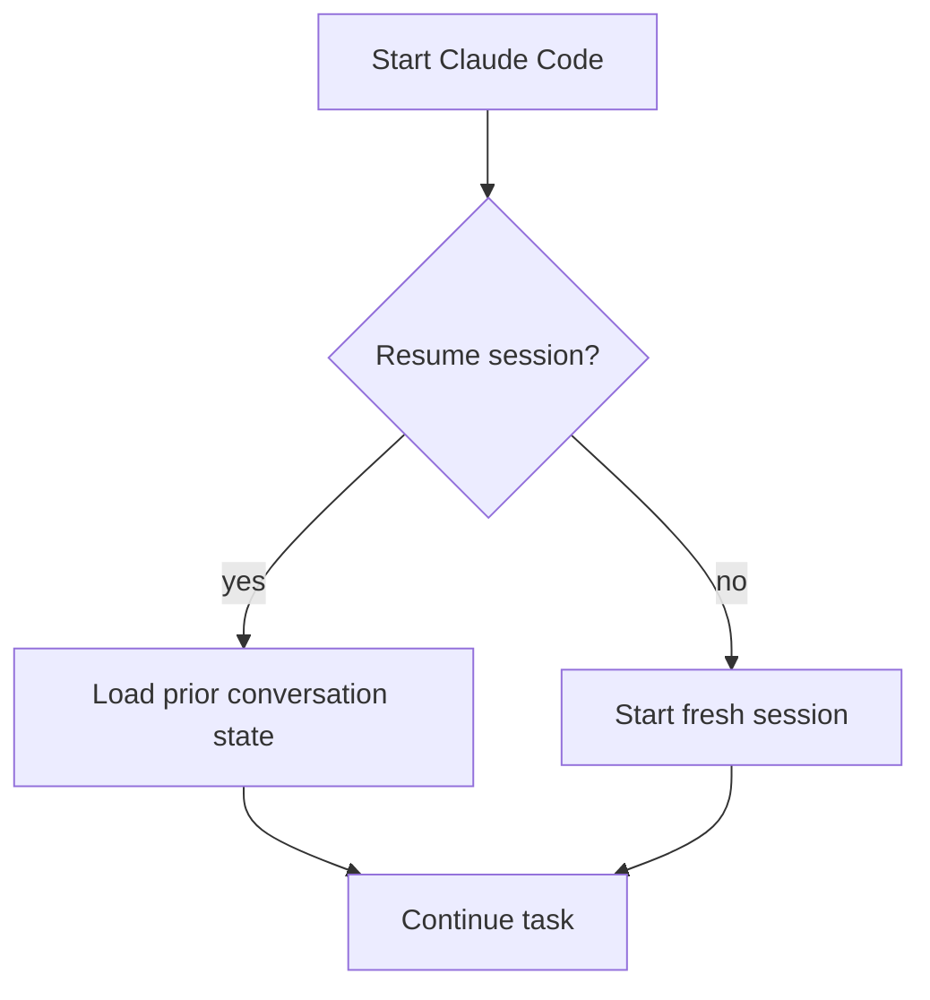
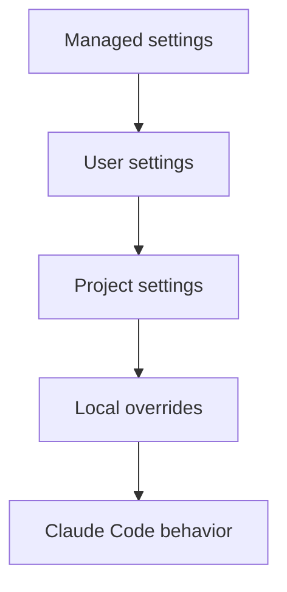

# Module 2: Claude Code Configuration & Workflows

This module is about separating repository rules, user rules, and session state so the system remains predictable. The main failure mode here is mixing policy, memory, and runtime control into one undifferentiated pile.

## Anti-patterns to avoid

- no `CLAUDE.md`: leaves the repo with no durable operating rules.
- flat rules: everything has the same priority, so nothing has a clear scope.
- prompt-only repository standards: standards vanish as soon as the prompt changes.
- wrong scope for repo rules: project policy leaks into user policy or vice versa.
- mixing CLI state with API state: creates confusion about what is durable and what is session-local.
- `--resume` confusion: resuming a session is not the same as reconstructing config state.
- relying on `/compact` first: compaction is a pressure valve, not a design strategy.
- ignoring settings precedence: produces contradictory behavior that is hard to debug.
- using user rules for project rules: the wrong layer now has to carry repo-specific intent.

## Pattern tradeoffs

- `CLAUDE.md` hierarchy: gives a clear inheritance model, but only if people respect scope.
- `CLAUDE.local.md`: useful for local overrides without polluting shared policy.
- user-level rules: good for personal defaults, but dangerous as a substitute for repo rules.
- project rules: keep repo behavior stable across contributors.
- managed policy: valuable for centrally enforced constraints, especially in shared environments.
- settings precedence: makes conflicts debuggable when the hierarchy is explicit.
- permission modes: let you tune safety versus convenience.
- plan mode: useful for thinking before acting, but not a replacement for execution discipline.
- session management: helps preserve continuity without pretending memory is free.
- `/memory`: good for durable working memory when used sparingly.
- prompt caching: improves efficiency, but it can also hide stale assumptions.
- `claudeMdExcludes`: prevents unwanted instruction inheritance in nested trees.
- skills for reusable behavior: great for standardization and reuse.
- YAML frontmatter: useful for metadata, but only if you keep it consistent.
- directory-qualified skill names: help disambiguate behavior in larger repos.
- nested skills: allow local specialization, at the cost of more policy surface.
- GitHub Actions workflows: make automation reproducible and reviewable.

## Topic notes

### Claude Code overview
- **What it is:** A high-level map of Claude Code as a coding-agent environment with project instructions, settings, tools, skills, and sessions.
- **When to use:** Use it when a scenario involves Claude Code overview and asks which mechanism, scope, boundary, or reliability pattern fits.
- **Pros:** Helps you reason about where config lives, how sessions behave, and which layer owns which decision.
- **Cons:** People often use the overview as a substitute for actually mapping their own repo rules.

### How Claude Code works
- **What it is:** The operating model for how Claude Code reads project context, follows configuration, runs tools, and manages an interactive coding session.
- **When to use:** Use it when a scenario involves How Claude Code works and asks which mechanism, scope, boundary, or reliability pattern fits.
- **Pros:** Knowing the operational model makes configuration choices less arbitrary.
- **Cons:** The mechanics are easy to overgeneralize into rules that do not fit a specific repo.

### `.claude` directory
- **What it is:** A project-local support directory for Claude Code configuration, commands, memories, hooks, or related agent files.
- **When to use:** Use it when a scenario involves .claude directory and asks which mechanism, scope, boundary, or reliability pattern fits.
- **Pros:** A clear home for project-local state, memory, and support files.
- **Cons:** If you dump too much into it, the directory becomes an unstructured attic.

### store instructions and memories
- **What it is:** The separation between durable guidance the agent should follow and remembered project or user context it can reuse later.
- **When to use:** Use it when a scenario involves store instructions and memories and asks which mechanism, scope, boundary, or reliability pattern fits.
- **Pros:** Separates durable guidance from ephemeral chat context.
- **Cons:** If everything becomes "memory," nothing is actually authoritative.

### manage sessions
- **What it is:** The practices for starting, resuming, compacting, and continuing Claude Code conversations without confusing session state with durable config.
- **When to use:** Use it when a scenario involves manage sessions and asks which mechanism, scope, boundary, or reliability pattern fits.

- **Pros:** Keeps long-running work coherent and reduces accidental context loss.
- **Cons:** Session continuity can hide stale assumptions if you do not refresh intent explicitly.

### common workflows
- **What it is:** Repeatable Claude Code operating patterns such as planning, editing, reviewing, testing, and committing.
- **When to use:** Use it when a scenario involves common workflows and asks which mechanism, scope, boundary, or reliability pattern fits.
- **Pros:** Good for making repeated work predictable and reviewable.
- **Cons:** Workflows that are too rigid do not survive variation well.

### prompt library
- **What it is:** A reusable collection of prompts or command patterns for recurring tasks.
- **When to use:** Use it when a scenario involves prompt library and asks which mechanism, scope, boundary, or reliability pattern fits.
- **Pros:** Reuse saves time and improves consistency.
- **Cons:** Libraries rot fast if they are not curated against real usage.

### best practices
- **What it is:** Project or workflow conventions that make Claude Code behavior predictable and easier to review.
- **When to use:** Use it when a scenario involves best practices and asks which mechanism, scope, boundary, or reliability pattern fits.
- **Pros:** Encode what has already been learned to work in the repo.
- **Cons:** "Best practice" without a concrete scope becomes vague advice.

### settings
- **What it is:** Configuration values that control Claude Code behavior across global, user, project, and local scopes.
- **When to use:** Use it when a scenario involves settings and asks which mechanism, scope, boundary, or reliability pattern fits.

- **Pros:** Central point for behavior control.
- **Cons:** Too many settings produce hidden coupling and hard-to-debug precedence issues.

### managed settings
- **What it is:** Organization-controlled settings that enforce policy across users or environments.
- **When to use:** Use it when a scenario involves managed settings and asks which mechanism, scope, boundary, or reliability pattern fits.
- **Pros:** Strong governance for shared environments.
- **Cons:** Can feel restrictive when local experimentation is needed.

### permission settings
- **What it is:** Configuration that controls which tools and operations Claude Code may run without additional approval.
- **When to use:** Use it when a scenario involves permission settings and asks which mechanism, scope, boundary, or reliability pattern fits.
- **Pros:** Control the blast radius of risky operations.
- **Cons:** Excessively strict permissions make simple workflows annoying.

### project settings
- **What it is:** Repository-scoped settings intended to make behavior consistent for everyone working in that project.
- **When to use:** Use it when a scenario involves project settings and asks which mechanism, scope, boundary, or reliability pattern fits.
- **Pros:** Keep behavior tied to the project instead of the person.
- **Cons:** They need maintenance as the project changes.

### user settings
- **What it is:** Personal settings for developer defaults and preferences across projects.
- **When to use:** Use it when a scenario involves user settings and asks which mechanism, scope, boundary, or reliability pattern fits.
- **Pros:** Good for personal defaults and comfort.
- **Cons:** A bad place to encode repo policy.

### global settings
- **What it is:** Broad defaults that apply across many projects or environments unless overridden by narrower scopes.
- **When to use:** Use it when a scenario involves global settings and asks which mechanism, scope, boundary, or reliability pattern fits.
- **Pros:** Reduce repeated setup across projects.
- **Cons:** Global defaults can quietly override local intent if you are not careful.

### skill files
- **What it is:** Files that package reusable agent behavior into named capabilities.
- **When to use:** Use it when a scenario involves skill files and asks which mechanism, scope, boundary, or reliability pattern fits.
- **Pros:** Package behavior into reusable, named units.
- **Cons:** If overused, they become another layer of indirection.

### `SKILL.md`
- **What it is:** The main instruction file that defines what a skill does, when it applies, and how it should operate.
- **When to use:** Use it when a scenario involves SKILL.md and asks which mechanism, scope, boundary, or reliability pattern fits.
- **Pros:** A durable contract for behavior and invocation.
- **Cons:** If the file is too broad, it stops being a useful contract.

### `allowed-tools`
- **What it is:** Skill metadata that limits which tools a skill is allowed to use.
- **When to use:** Use it when a scenario involves allowed-tools and asks which mechanism, scope, boundary, or reliability pattern fits.
- **Pros:** Restricts what a skill can use, which improves safety and clarity.
- **Cons:** Too narrow and the skill becomes unusable.

### `disable-model-invocation`
- **What it is:** Skill metadata that prevents a skill from invoking the model when the behavior should remain static or deterministic.
- **When to use:** Use it when a scenario involves disable-model-invocation and asks which mechanism, scope, boundary, or reliability pattern fits.
- **Pros:** Useful when a skill should only expose static behavior or deterministic steps.
- **Cons:** Removes flexibility when the task really does need model reasoning.

### `description`
- **What it is:** A routing field that tells the agent when a tool, skill, or item should be selected.
- **When to use:** Use it when a scenario involves description and asks which mechanism, scope, boundary, or reliability pattern fits.
- **Pros:** Gives fast routing signal and helps selection.
- **Cons:** Weak descriptions produce weak tool or skill choice.

### `name`
- **What it is:** A stable identifier used for routing, referencing, and disambiguating tools or skills.
- **When to use:** Use it when a scenario involves name and asks which mechanism, scope, boundary, or reliability pattern fits.
- **Pros:** Stable identifier for reuse and composition.
- **Cons:** Poor naming creates ambiguity across nested scopes.

### `context: fork`
- **What it is:** A branching mode that isolates a workstream from the parent context while preserving the parent state.
- **When to use:** Use it when related workstreams need isolation but still originate from the same parent task.
- **Pros:** Lets you branch work cleanly without contaminating the parent context.
- **Cons:** Forks increase the number of states you have to reconcile later.

### slash-command skills
- **What it is:** Skills exposed as command-like workflows for fast repeated invocation.
- **When to use:** Use it when a scenario involves slash-command skills and asks which mechanism, scope, boundary, or reliability pattern fits.
- **Pros:** Fast access for common behaviors and workflows.
- **Cons:** They can become a second hidden API if documented poorly.

### nested skill variants
- **What it is:** Directory-scoped skill variants that specialize behavior for a narrower part of a project.
- **When to use:** Use it when a scenario involves nested skill variants and asks which mechanism, scope, boundary, or reliability pattern fits.
- **Pros:** Support specialization by directory or scope.
- **Cons:** More variants means more chance of accidental mismatch.

### code review automation
- **What it is:** Automated checks or review workflows that inspect changes for defects, risks, and policy violations.
- **When to use:** Use it when a scenario involves code review automation and asks which mechanism, scope, boundary, or reliability pattern fits.
- **Pros:** Makes review repeatable and can catch obvious regressions early.
- **Cons:** Automated review is only as good as the policy and context it receives.

### CI/CD integration
- **What it is:** Connecting Claude Code workflows to build, test, review, or deployment automation.
- **When to use:** Use it when a scenario involves CI/CD integration and asks which mechanism, scope, boundary, or reliability pattern fits.
- **Pros:** Pushes validation closer to the change, which reduces surprises later.
- **Cons:** CI that mirrors bad local assumptions just automates the wrong thing faster.

## Exam pattern

### What the question is usually testing

- Whether you know which layer owns repo rules, user rules, global settings, and runtime session state.
- Whether you can distinguish durable project configuration from ephemeral CLI state.
- Whether you can tell when a question is about Claude Code behavior versus API behavior.
- Whether you choose the right mechanism for reuse: `CLAUDE.md`, skills, hooks, or workflows.

### What to notice first

- Words like `project`, `user`, `global`, `settings precedence`, `resume`, `session`, `memory`, `skills`, `hooks`, `plan mode`, or `CLAUDE.md`.
- Phrases about "team-wide", "repo-wide", "personal", or "local override".
- Mentions of enforcement, automation, or repeatability.
- Any statement about instructions needing to persist across sessions or across contributors.

### How to eliminate wrong answers

- Eliminate answers that put project policy in user-level settings.
- Eliminate answers that rely on prompt-only standards when the issue is durable repo behavior.
- Eliminate answers that use `/compact` as the primary design strategy.
- Eliminate answers that confuse `--resume` with persistence or synchronization.

### How to answer correctly

- Put repo policy in `CLAUDE.md` and local overrides in `CLAUDE.local.md` when needed.
- Use user settings only for personal defaults, not shared standards.
- Use skills for reusable behaviors and hooks for enforcement or automation.
- Treat `.claude` as the project-local support area and respect settings precedence when there is overlap.
- If the question is about operational discipline, prefer the layer that makes the behavior durable and visible.

### Common question shapes

- "Where should this instruction live?" -> choose the narrowest durable scope that matches the audience.
- "What survives between sessions?" -> memory, files, and settings; not raw chat state.
- "What is the right place for repo standards?" -> `CLAUDE.md`, not user settings.
- "How do you enforce a recurring action?" -> hooks or workflows, not prompt reminders.

### Short answer rule

- If it is shared repo policy, put it in repo-scoped config.
- If it is personal preference, keep it in user settings.
- If it is execution-time enforcement, use hooks or automation.
- If it is just a transient task, keep it in the session.