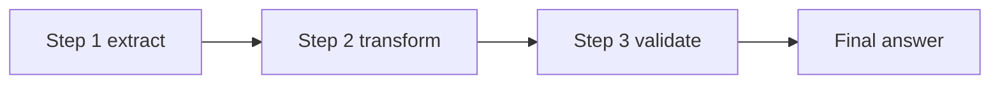
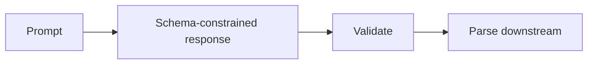
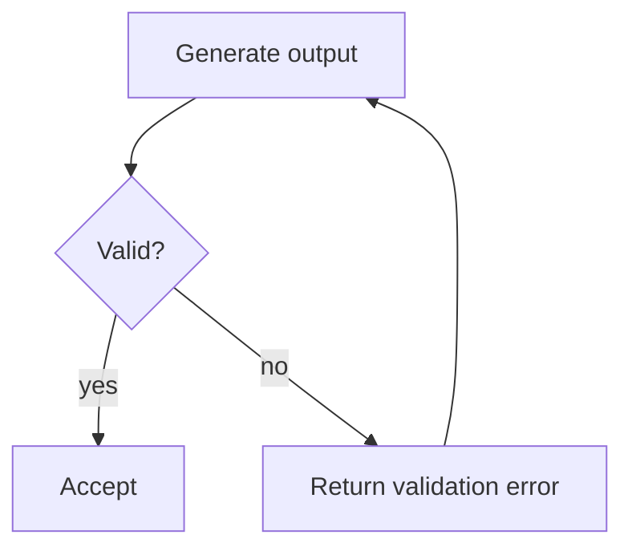

# Module 3: Prompt Engineering & Structured Output

This module is about getting output that is stable enough to trust and automate. The main distinction is between prompts that sound good and prompts that consistently produce the right shape.

## Anti-patterns to avoid

- contradictory instructions: the model cannot satisfy incompatible constraints reliably.
- more prose after prose already failed: adds noise without changing the mechanism.
- no examples: makes the intended shape harder to infer.
- no schema for structure: leaves output format ambiguous.
- no validation loop: errors are discovered only after downstream failure.
- confidence as correctness: fluent text is not proof.
- irrelevant context: distracts the model from the actual task.
- overfitting to one wording: creates brittle prompts that collapse under variation.

## Pattern tradeoffs

- few-shot prompting: strong when the target behavior is subtle, but expensive in context.
- explicit criteria: improves evaluation and reduces ambiguity.
- JSON schema: excellent for machine-readable output, but rigid if the task is exploratory.
- XML structuring: good for separation of sections and roles.
- role prompting: useful for framing, though it can be oversold as a magic fix.
- thinking: helps with harder reasoning, but does not replace clear constraints.
- prompt chaining: decomposes complex work, at the cost of extra latency and failure points.
- prompt generator: scales prompt creation, but can also scale bad assumptions.
- templates and variables: make prompts reusable and maintainable.
- prompt improver: useful for refinement, but only when you already know what good looks like.
- structured outputs: easier to validate and integrate.
- prefill: can anchor format and style.
- validation-retry: recovers from format drift or partial failures.
- self-critique: helps catch inconsistencies, but should not be treated as objective truth.
- evaluator-optimizer: powerful for iterative improvement, but it adds orchestration complexity.
- extraction patterns: good when the task is to preserve facts rather than generate new ones.
- context engineering: lets you shape the input so the model works on the right problem.

## Topic notes

### Prompting best practices
- **What it is:** General prompt design principles for giving Claude clear goals, context, constraints, examples, and output expectations.
- **When to use:** Use it when a scenario involves Prompting best practices and asks which mechanism, scope, boundary, or reliability pattern fits.
- **Pros:** Gives you a principled baseline instead of ad hoc prompt edits.
- **Cons:** Best practices are generic; they still need adaptation to the task and output contract.

### clarity
- **What it is:** The discipline of making the task, constraints, audience, and desired output unambiguous.
- **When to use:** Use it when a scenario involves clarity and asks which mechanism, scope, boundary, or reliability pattern fits.
- **Pros:** Lower ambiguity means fewer surprises and less downstream correction.
- **Cons:** Over-clarifying can make prompts bloated and harder to maintain.

### examples
- **What it is:** Concrete demonstrations of the desired behavior or output shape.
- **When to use:** Use it when a scenario involves examples and asks which mechanism, scope, boundary, or reliability pattern fits.
- **Pros:** Show the model the target shape directly, which is often the fastest path to consistency.
- **Cons:** Bad examples teach bad behavior; too many examples can crowd out the actual task.

### XML structuring
- **What it is:** Using XML-style tags to separate instructions, context, examples, and output fields.
- **When to use:** Use it when a scenario involves XML structuring and asks which mechanism, scope, boundary, or reliability pattern fits.
- **Pros:** Good for chunking instructions, roles, and content boundaries.
- **Cons:** If the structure is decorative rather than functional, it just adds noise.

### role prompting
- **What it is:** Framing Claude with a role, perspective, or decision style to bias how it approaches the task.
- **When to use:** Use it when a scenario involves role prompting and asks which mechanism, scope, boundary, or reliability pattern fits.
- **Pros:** Helps bias tone, priorities, and decision style.
- **Cons:** The role frame does not guarantee quality if the underlying task is underspecified.

### thinking
- **What it is:** Giving the model room or instruction to reason through a problem before producing the final answer.
- **When to use:** Use it when a scenario involves thinking and asks which mechanism, scope, boundary, or reliability pattern fits.
- **Pros:** Gives the model room to reason through tricky cases.
- **Cons:** More thinking is not a substitute for better constraints or examples.

### prompt chaining
- **What it is:** Splitting a complex task into multiple prompts where each step produces input for the next.
- **When to use:** Use it when a task is easier to validate as ordered intermediate steps.

- **Pros:** Breaks large tasks into verifiable steps.
- **Cons:** Adds orchestration overhead and can compound errors between stages.

### structured outputs
- **What it is:** Constraining responses into predictable formats that can be parsed, validated, or stored.
- **When to use:** Use it when a program, test, or database needs to consume Claude responses reliably.

- **Pros:** Easier to parse, validate, store, and compare.
- **Cons:** Can be too rigid when the task needs nuance or open-ended synthesis.

### JSON
- **What it is:** A machine-readable output format suited for APIs, schemas, validation, and downstream automation.
- **When to use:** Use it when a scenario involves JSON and asks which mechanism, scope, boundary, or reliability pattern fits.
- **Pros:** Ideal for downstream automation and schema validation.
- **Cons:** Human readability suffers when the content is mostly narrative.

### XML
- **What it is:** A tag-based structure useful for nested sections, named fields, and clear content boundaries.
- **When to use:** Use it when a scenario involves XML and asks which mechanism, scope, boundary, or reliability pattern fits.
- **Pros:** Flexible for nested sections and bounded fields.
- **Cons:** Verbosity increases quickly, and malformed structure can still happen.

### custom templates
- **What it is:** Reusable prompt skeletons with variables for repeated tasks.
- **When to use:** Use it when a scenario involves custom templates and asks which mechanism, scope, boundary, or reliability pattern fits.
- **Pros:** Capture recurring prompt patterns cleanly.
- **Cons:** Templates invite copy-paste reuse even when the original assumptions no longer hold.

### response prefill
- **What it is:** Starting the response with an expected prefix or structure to anchor the output format.
- **When to use:** Use it when a scenario involves response prefill and asks which mechanism, scope, boundary, or reliability pattern fits.
- **Pros:** Strong way to anchor the model into a desired structure or style.
- **Cons:** Prefill can overconstrain the response if the task needs creativity.

### output consistency
- **What it is:** The property that repeated runs produce stable shape, style, and decision behavior.
- **When to use:** Use it when a scenario involves output consistency and asks which mechanism, scope, boundary, or reliability pattern fits.
- **Pros:** The main requirement for production pipelines, evals, and comparison work.
- **Cons:** Consistency can come at the cost of variety or exploration.

### few-shot examples
- **What it is:** A prompting method that shows multiple input-output examples before asking for a new output.
- **When to use:** Use it when a scenario involves few-shot examples and asks which mechanism, scope, boundary, or reliability pattern fits.
- **Pros:** Better than vague prose when the output has subtle boundaries.
- **Cons:** The model can overfit to the examples instead of the task.

### explicit criteria prompts
- **What it is:** Prompts that define measurable rules for judging whether an answer is acceptable.
- **When to use:** Use it when a scenario involves explicit criteria prompts and asks which mechanism, scope, boundary, or reliability pattern fits.
- **Pros:** Make success measurable and easier to review.
- **Cons:** Too many criteria can become conflicting constraints.

### consistency guardrails
- **What it is:** Prompt, schema, or validation mechanisms that reduce format drift and inconsistent behavior.
- **When to use:** Use it when a scenario involves consistency guardrails and asks which mechanism, scope, boundary, or reliability pattern fits.
- **Pros:** Reduce format drift and quality swings.
- **Cons:** Over-guardrailing can make prompts brittle or overfitted to narrow test cases.

### validation-retry loops
- **What it is:** A loop that checks output against rules or schema and retries with feedback when it fails.
- **When to use:** Use it when output must satisfy a schema or quality gate before downstream use.

- **Pros:** A practical way to enforce correctness without trusting a single pass.
- **Cons:** Retrying blindly can waste time unless the validation signal is meaningful.

### self-review passes
- **What it is:** A second pass where Claude reviews its own output for omissions, contradictions, or rule violations.
- **When to use:** Use it when a scenario involves self-review passes and asks which mechanism, scope, boundary, or reliability pattern fits.
- **Pros:** Helps the model catch its own omissions before you do.
- **Cons:** Self-review is still model judgment, not an external ground truth.

## Exam pattern

### What the question is usually testing

- Whether you can map the output problem to the right mechanism: examples, criteria, schema, prefill, chaining, or self-critique.
- Whether you know when prose is enough and when structure is required.
- Whether you distinguish a known pattern from unknown, case-specific gaps.
- Whether you can prevent invalid output structurally instead of describing the rule again.

### What to notice first

- Words like `consistent`, `variable`, `examples`, `schema`, `structured output`, `JSON`, `XML`, `prefill`, `criteria`, `evaluate`, `retry`, `self-critique`, or `chain`.
- Phrases like "still inconsistent after detailed instructions" or "frequently misses different things".
- Whether the output is for a person to read or a machine to consume.
- Whether the failure is format drift, classification drift, or reasoning drift.

### How to eliminate wrong answers

- Eliminate more prose if the question already says prose failed.
- Eliminate prompt-only fixes when the question is really asking for schema enforcement.
- Eliminate self-critique when the problem is a known pattern that can be demonstrated with examples.
- Eliminate few-shot when the question is about invalid structure that should be impossible, not just discouraged.

### How to answer correctly

- Use few-shot examples for nuanced patterns that are known but hard to describe cleanly.
- Use explicit criteria when the output can be judged by stable rules.
- Use schema plus validation-retry when the output must be machine-readable and valid.
- Use self-critique or evaluator-optimizer when the failures are variable and hard to enumerate.
- Pick the minimum mechanism that actually fixes the failure mode, not the one that sounds most sophisticated.

### Common question shapes

- "The model keeps missing the same nuanced distinction." -> few-shot or criteria, depending on whether the rule is demonstrable.
- "The output format keeps breaking." -> schema plus validation, not more prose.
- "The failures change from case to case." -> self-critique or evaluator-optimizer.
- "The question asks for high consistency." -> structure first, then examples, then validation.

### Short answer rule

- Known pattern -> show examples.
- Stable rule -> write criteria.
- Invalid format -> enforce schema.
- Variable failures -> add a review pass.