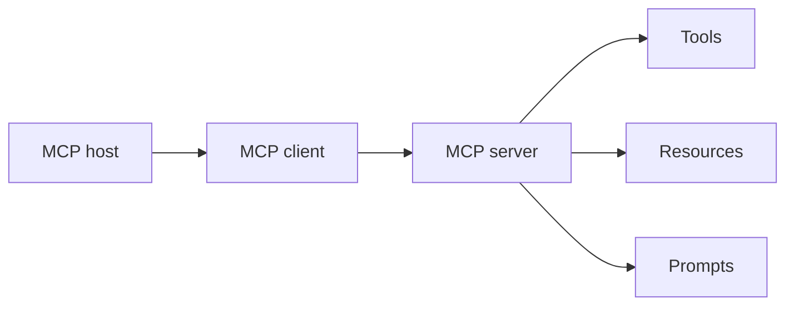
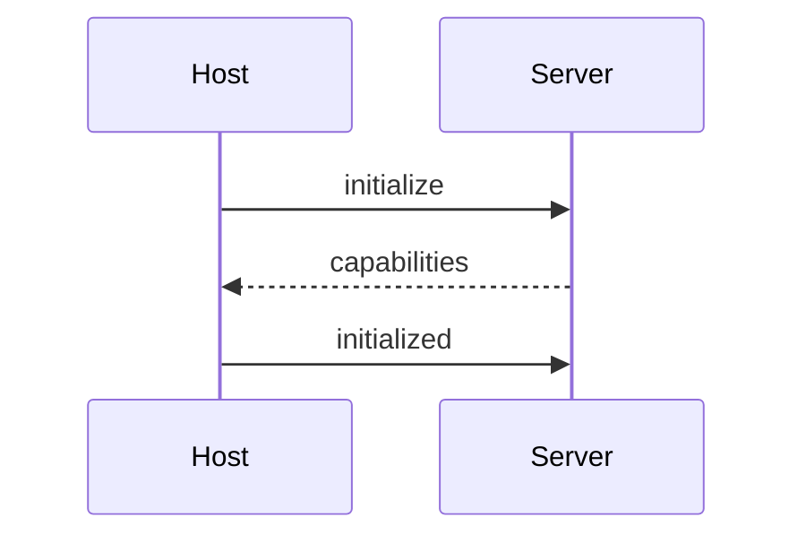
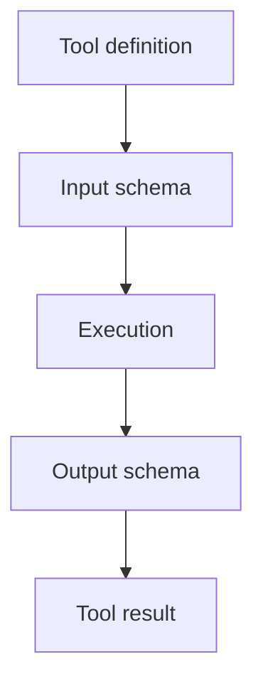

# Module 4: Tool Design & MCP

This module is about designing tools that are safe, discoverable, and easy for agents to use correctly. Good tool design reduces prompt burden because the interface itself carries the discipline.

## Anti-patterns to avoid

- mega-tools: one endpoint tries to do everything, which makes it hard to route or validate.
- vague tool descriptions: the model cannot choose well if the contract is unclear.
- stateful tools without retry safety: retries become dangerous or inconsistent.
- too many tools at once: selection gets noisy and tool use becomes fragile.
- prompt instructions used as interface enforcement: text instructions are not a substitute for API constraints.
- treating resources like tools: confuses read-only data with actionable operations.
- missing access controls: creates obvious safety and governance problems.
- missing rate limits: invites overload and unpredictable latency.
- unsanitized outputs: tool results can contaminate the model or the user.

## Pattern tradeoffs

- one tool, one responsibility: easiest to test and reason about, but can feel granular.
- precise descriptions: improves routing accuracy and developer understanding.
- input schema: enforces shape before the tool runs.
- output schema: makes results easier to consume and validate.
- annotations: useful for metadata, routing hints, or operational context.
- structured error responses: better than exceptions buried in text.
- user confirmation: essential for risky actions.
- timeouts: prevent runaway calls and hung workflows.
- logging: critical for observability and debugging.
- rate limiting: protects the service and the user experience.
- output sanitization: reduces injection and parsing risk.
- tool discovery: scales better than hardcoding every capability.
- pagination: keeps large result sets manageable.
- server-side tools: easier to govern centrally.
- client-side tools: better when the action depends on local runtime or UI state.

## Topic notes

### MCP specification
- **What it is:** The Model Context Protocol contract that standardizes how hosts connect to servers exposing tools, resources, and prompts.
- **When to use:** Use it when a scenario involves MCP specification and asks which mechanism, scope, boundary, or reliability pattern fits.
- **Pros:** Gives a common language for tools, resources, and prompts across hosts and servers.
- **Cons:** A spec only helps if implementers follow it carefully.

### MCP architecture
- **What it is:** The host-client-server structure used by MCP to separate model interaction from capability providers.
- **When to use:** Use it when deciding where host, client, and server responsibilities belong.

- **Pros:** Separates concerns cleanly between host, client, and server roles.
- **Cons:** Architectural clarity does not remove the need for careful boundary design.

### MCP host
- **What it is:** The application that coordinates the model, MCP clients, policy, and user interaction.
- **When to use:** Use it when a scenario involves MCP host and asks which mechanism, scope, boundary, or reliability pattern fits.
- **Pros:** Central place to coordinate model, tools, and policy.
- **Cons:** Too much host logic can turn it into a second monolith.

### MCP client
- **What it is:** The connector inside a host that communicates with an MCP server.
- **When to use:** Use it when a scenario involves MCP client and asks which mechanism, scope, boundary, or reliability pattern fits.
- **Pros:** Keeps the user-facing integration close to the interaction loop.
- **Cons:** Client behavior varies by environment, so portability is not automatic.

### MCP server
- **What it is:** A service that exposes capabilities such as tools, resources, and prompts over the MCP contract.
- **When to use:** Use it when a scenario involves MCP server and asks which mechanism, scope, boundary, or reliability pattern fits.
- **Pros:** Encapsulates capabilities behind a stable interface.
- **Cons:** Server bugs are now shared by every consumer of that capability.

### initialization
- **What it is:** The startup handshake where client and server exchange protocol version, capabilities, and readiness.
- **When to use:** Use it when a scenario involves initialization and asks which mechanism, scope, boundary, or reliability pattern fits.

- **Pros:** Sets capabilities and constraints up front, which reduces ambiguity later.
- **Cons:** If initialization is incomplete, later failures are harder to diagnose.

### capabilities
- **What it is:** The declared features a server or client supports, used for discovery and routing.
- **When to use:** Use it when a scenario involves capabilities and asks which mechanism, scope, boundary, or reliability pattern fits.
- **Pros:** Make the available surface explicit and routable.
- **Cons:** Capability lists can become stale if they are not maintained.

### tools
- **What it is:** Callable operations for actions, computations, or external data access.
- **When to use:** Use it when the model needs an action, computation, or external data operation.

- **Pros:** The right abstraction for actions that change state or fetch external data.
- **Cons:** Poorly defined tools become a liability instead of a capability.

### resources
- **What it is:** Read-only context or data exposed by an MCP server.
- **When to use:** Use it when the model needs read-only reference data rather than an action.
- **Pros:** Good for read-only data and reference material.
- **Cons:** If you blur resources with tools, you confuse access semantics.

### prompts
- **What it is:** Reusable prompt templates or guided interactions exposed by an MCP server.
- **When to use:** Use it when reusable guidance or a guided workflow should be discoverable.
- **Pros:** Useful for reusable instruction templates and guided interactions.
- **Cons:** Prompts are not a control plane; they should not enforce behavior that belongs in code.

### `resources/list`
- **What it is:** The MCP operation for discovering available resources.
- **When to use:** Use it when a scenario involves resources/list and asks which mechanism, scope, boundary, or reliability pattern fits.
- **Pros:** Helps clients discover available data sources.
- **Cons:** Discovery output still has to be kept accurate and small enough to scan.

### `prompts/list`
- **What it is:** The MCP operation for discovering available prompt templates.
- **When to use:** Use it when a scenario involves prompts/list and asks which mechanism, scope, boundary, or reliability pattern fits.
- **Pros:** Makes reusable prompt entries discoverable.
- **Cons:** Too many prompt entries create a weak, noisy menu.

### tool definitions
- **What it is:** The metadata, schema, and description that define how a tool is selected and called.
- **When to use:** Use it when a scenario involves tool definitions and asks which mechanism, scope, boundary, or reliability pattern fits.
- **Pros:** The contract is explicit and machine-checkable.
- **Cons:** Strong contracts take real work to design and maintain.

### `name`
- **What it is:** A stable identifier used for routing, referencing, and disambiguating tools or skills.
- **When to use:** Use it when a scenario involves name and asks which mechanism, scope, boundary, or reliability pattern fits.
- **Pros:** Stable identifier for routing and code references.
- **Cons:** A bad name leaks confusion into every layer that touches the tool.

### `title`
- **What it is:** A human-readable label for a tool or item.
- **When to use:** Use it when a scenario involves title and asks which mechanism, scope, boundary, or reliability pattern fits.
- **Pros:** Human-friendly label for browsing and selection.
- **Cons:** If the title diverges from the actual behavior, users and models both get misled.

### `description`
- **What it is:** A routing field that tells the agent when a tool, skill, or item should be selected.
- **When to use:** Use it when a scenario involves description and asks which mechanism, scope, boundary, or reliability pattern fits.
- **Pros:** Usually the highest-leverage field for tool selection.
- **Cons:** Overwritten marketing copy is worse than no description.

### `inputSchema`
- **What it is:** A JSON Schema contract that validates tool inputs before execution.
- **When to use:** Use it when a scenario involves inputSchema and asks which mechanism, scope, boundary, or reliability pattern fits.
- **Pros:** Enforces the expected input shape before execution.
- **Cons:** Schemas can become cumbersome if you force every variation through one interface.

### `outputSchema`
- **What it is:** A schema contract that describes or validates the shape of tool results.
- **When to use:** Use it when a scenario involves outputSchema and asks which mechanism, scope, boundary, or reliability pattern fits.
- **Pros:** Makes downstream processing much easier to trust.
- **Cons:** Rigid outputs can be awkward for loosely structured results.

### `annotations`
- **What it is:** Optional metadata that adds hints or context without changing the core tool contract.
- **When to use:** Use it when a scenario involves annotations and asks which mechanism, scope, boundary, or reliability pattern fits.
- **Pros:** Let you attach useful metadata without bloating the core contract.
- **Cons:** Metadata sprawl can obscure the actual behavior.

### MCP Inspector
- **What it is:** An interactive diagnostic tool for inspecting and testing MCP servers.
- **When to use:** Use it when a scenario involves MCP Inspector and asks which mechanism, scope, boundary, or reliability pattern fits.
- **Pros:** Useful for testing, debugging, and understanding a server interactively.
- **Cons:** It is a diagnostic tool, not a substitute for real client behavior testing.

### reference server implementations
- **What it is:** Example MCP servers that demonstrate expected patterns and protocol behavior.
- **When to use:** Use it when a scenario involves reference server implementations and asks which mechanism, scope, boundary, or reliability pattern fits.
- **Pros:** Good starting points and examples of expected patterns.
- **Cons:** Example code can ossify into cargo-culted architecture if you do not understand the tradeoffs.

### server quickstart
- **What it is:** A minimal path for creating and running an MCP server.
- **When to use:** Use it when a scenario involves server quickstart and asks which mechanism, scope, boundary, or reliability pattern fits.
- **Pros:** Lowers adoption friction.
- **Cons:** Quickstarts often omit the hard edges that matter in production.

### client quickstart
- **What it is:** A minimal path for connecting a host or client to an MCP server.
- **When to use:** Use it when a scenario involves client quickstart and asks which mechanism, scope, boundary, or reliability pattern fits.
- **Pros:** Gets integrations moving fast and shows the main call flow.
- **Cons:** A quickstart client may hide important lifecycle and error-handling work.

## Exam pattern

### What the question is usually testing

- Whether you know the difference between tools, resources, and prompts.
- Whether you can design the interface so the model cannot misuse it easily.
- Whether you recognize that discovery, schema, and error handling are part of the contract.
- Whether you choose MCP boundaries correctly instead of stuffing everything into one mega-tool.

### What to notice first

- Words like `tool`, `resource`, `prompt`, `schema`, `discovery`, `MCP`, `host`, `client`, `server`, `pagination`, `logging`, `rate limit`, or `sanitization`.
- Phrases about "read-only data" versus "actions".
- Statements about needing to prevent misuse at the interface level.
- Questions asking whether something should be a tool, a resource, or a prompt.

### How to eliminate wrong answers

- Eliminate answers that use prompt text to enforce a rule that belongs in the API or schema.
- Eliminate mega-tools when the task can be split into one responsibility per tool.
- Eliminate resources for actions and tools for static reference data.
- Eliminate answers that skip access control, output sanitization, or rate limiting when the question mentions safety or scale.

### How to answer correctly

- Use a precise `inputSchema` and `outputSchema` when correctness matters.
- Use resources for read-only content and tools for actions or side effects.
- Use prompts for reusable guidance, not enforcement.
- Add logging, timeouts, pagination, and structured errors when the question is about production reliability.
- Prefer the design that makes selection and validation obvious to both the model and the host.

### Common question shapes

- "Should this be a tool or a resource?" -> ask whether it performs an action or exposes data.
- "How do you prevent invalid arguments?" -> schema, not prompt text.
- "How do you keep tool selection accurate?" -> precise description, name, and responsibility.
- "How do you make a server safe at scale?" -> access control, logging, rate limiting, sanitization.

### Short answer rule

- Action -> tool.
- Read-only data -> resource.
- Reusable instruction -> prompt.
- Enforcement -> schema or code, not prose.