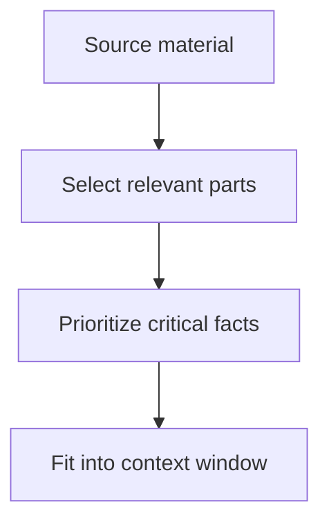
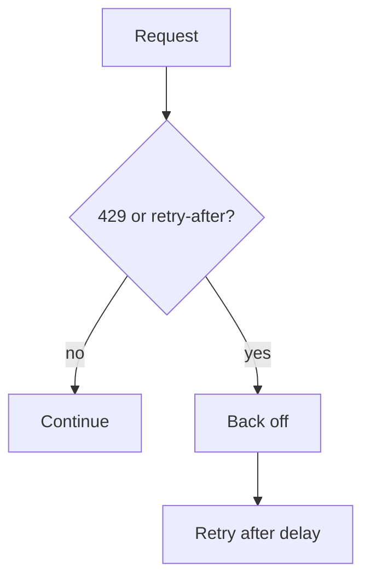
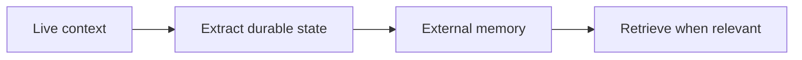

# Module 5: Context Management & Reliability

This module is about keeping the right information available without letting context become a landfill. Reliability work here is mostly about choosing what to retain, what to summarize, and when to escalate.

## Anti-patterns to avoid

- key info in the middle: important facts get lost when they are buried in long context.
- unstructured context growth: makes retrieval, summarization, and auditability worse over time.
- no rolling summary: forces every turn to re-read everything.
- sending everything everywhere: creates token waste and confusion.
- one context track for every branch: leads to duplication and divergent state.
- no human escalation: the system keeps grinding on cases it should hand off.
- confidence as a substitute for judgment: fluent output is not a reliability strategy.
- ignoring rate-limit signals: guarantees avoidable failures.
- ignoring timeout errors: leaves you blind to infrastructure and service problems.

## Pattern tradeoffs

- progressive summarization: keeps long-running work usable, but summaries can lose detail.
- rolling summary: good for preserving state, though it needs careful upkeep.
- parallel extraction: efficient for fact gathering, but merge quality matters.
- `context: fork`: clean way to branch work while preserving the parent state.
- external memory: moves durable state out of the live context window.
- state persistence: useful for continuity across sessions.
- fallback strategies: improve survivability when a primary path fails.
- human-in-the-loop escalation: essential for ambiguity, risk, or repeated failure.
- confidence calibration: helps the system know when to trust itself less.
- circuit breaker: prevents repeated failure loops from wasting time.
- prompt caching: cuts cost and latency on repeated context.
- tool context management: keeps tool state scoped and relevant.

## Topic notes

### context windows
- **What it is:** The maximum amount of input and generated context that can be considered in one model interaction.
- **When to use:** Use it when a scenario involves context windows and asks which mechanism, scope, boundary, or reliability pattern fits.

- **Pros:** Set the hard envelope for what can be considered at once.
- **Cons:** The limit is real, so large windows can encourage sloppy packing.

### 200k context
- **What it is:** A large context-window size that allows substantial source material to stay available in a single request.
- **When to use:** Use it when a scenario involves 200k context and asks which mechanism, scope, boundary, or reliability pattern fits.
- **Pros:** Lets you keep more source material live without constant compression.
- **Cons:** Large windows do not eliminate lost-signal problems, and they can still be expensive.

### large input documents
- **What it is:** Long source materials that require careful ordering, chunking, extraction, or summarization.
- **When to use:** Use it when a scenario involves large input documents and asks which mechanism, scope, boundary, or reliability pattern fits.
- **Pros:** Useful when you need the model to work from primary source material directly.
- **Cons:** Long docs often need chunking, extraction, or summarization to be reliable.

### lost-in-the-middle
- **What it is:** The tendency for important information buried in the middle of long context to receive less attention.
- **When to use:** Use it when a scenario involves lost-in-the-middle and asks which mechanism, scope, boundary, or reliability pattern fits.
- **Pros:** Naming the problem helps you design around it instead of pretending position does not matter.
- **Cons:** There is no magic fix; you still need ordering, summaries, and extraction.

### prompt caching
- **What it is:** A cost and latency optimization that reuses stable prompt prefixes across requests.
- **When to use:** Use it when a scenario involves prompt caching and asks which mechanism, scope, boundary, or reliability pattern fits.
- **Pros:** Reduces repeated work and improves responsiveness.
- **Cons:** Cached context can encourage stale assumptions if you do not refresh it carefully.

### interleaved thinking
- **What it is:** A workflow where reasoning and tool use alternate closely, so the model can plan, act, observe, and continue.
- **When to use:** Use it when a scenario involves interleaved thinking and asks which mechanism, scope, boundary, or reliability pattern fits.
- **Pros:** Useful when the model has to alternate between observing, deciding, and acting.
- **Cons:** The more interleaving you do, the more you need explicit state boundaries.

### extended thinking
- **What it is:** A Claude capability that gives the model more reasoning budget for complex planning, analysis, or synthesis.
- **When to use:** Use it when a scenario involves extended thinking and asks which mechanism, scope, boundary, or reliability pattern fits.
- **Pros:** Helpful for complex reasoning or planning.
- **Cons:** It can hide poor context management if you lean on it for every hard case.

### tool context management
- **What it is:** Scoping tool inputs and outputs so only relevant state is carried forward.
- **When to use:** Use it when a scenario involves tool context management and asks which mechanism, scope, boundary, or reliability pattern fits.
- **Pros:** Keeps tool inputs and outputs scoped so the model is not swimming in irrelevant state.
- **Cons:** Requires discipline in what you pass forward and what you discard.

### rate limits
- **What it is:** Service constraints that limit request volume, token volume, or concurrency.
- **When to use:** Use it when failures involve throughput, quota, overload, retry timing, or backoff.

- **Pros:** Protect service stability and help enforce fairness.
- **Cons:** They can disrupt workflows unless you design retries and backoff around them.

### `retry-after`
- **What it is:** A response signal telling the client how long to wait before retrying.
- **When to use:** Use it when a scenario involves retry-after and asks which mechanism, scope, boundary, or reliability pattern fits.
- **Pros:** Gives a direct signal for when a retry is reasonable.
- **Cons:** Not every client respects it, which defeats the point.

### `429`
- **What it is:** An HTTP status indicating the caller is exceeding rate or quota limits.
- **When to use:** Use it when a scenario involves 429 and asks which mechanism, scope, boundary, or reliability pattern fits.
- **Pros:** Clear signal that the caller is exceeding allowed throughput.
- **Cons:** It is easy to treat as a transient nuisance when it is really a capacity or policy issue.

### `504`
- **What it is:** An HTTP status indicating a gateway or upstream timeout.
- **When to use:** Use it when a scenario involves 504 and asks which mechanism, scope, boundary, or reliability pattern fits.
- **Pros:** Indicates a timeout at the gateway or upstream boundary.
- **Cons:** If you retry blindly, you may just repeat a slow failure path.

### `529`
- **What it is:** An overload signal indicating the service is temporarily under too much load.
- **When to use:** Use it when a scenario involves 529 and asks which mechanism, scope, boundary, or reliability pattern fits.
- **Pros:** Communicates overloaded service conditions explicitly.
- **Cons:** Needs proper backoff or the system will amplify pressure.

### `request_too_large`
- **What it is:** An error indicating the request exceeds allowed size or context limits.
- **When to use:** Use it when a scenario involves request_too_large and asks which mechanism, scope, boundary, or reliability pattern fits.
- **Pros:** Prevents oversized payloads from wasting compute.
- **Cons:** Requires the client to chunk, trim, or summarize intentionally.

### `permission_error`
- **What it is:** An error indicating the requested operation is not allowed under current permissions.
- **When to use:** Use it when a scenario involves permission_error and asks which mechanism, scope, boundary, or reliability pattern fits.
- **Pros:** Stops unauthorized or unsafe operations early.
- **Cons:** If permissions are poorly understood, legitimate work fails noisily.

### error handling
- **What it is:** The strategy for classifying failures and choosing whether to retry, fall back, escalate, or stop.
- **When to use:** Use it when a scenario involves error handling and asks which mechanism, scope, boundary, or reliability pattern fits.
- **Pros:** The backbone of robust systems; it decides what happens when things fail.
- **Cons:** Error handling that is too generic can hide the true problem.

### long-context behavior
- **What it is:** How model quality and attention change as input size grows.
- **When to use:** Use it when a scenario involves long-context behavior and asks which mechanism, scope, boundary, or reliability pattern fits.
- **Pros:** Lets you reason about how the system degrades as input size grows.
- **Cons:** Long-context capability can tempt you into skipping structure and relevance control.

### external memory
- **What it is:** Durable state stored outside the live context window and retrieved when relevant.
- **When to use:** Use it when state must survive beyond a single context window or session.

- **Pros:** Good for durable facts, preferences, and intermediate state that should outlive a turn.
- **Cons:** External memory needs governance or it becomes stale, noisy, or unsafe.

## Exam pattern

### What the question is usually testing

- Whether you can see that the problem is context growth, not model intelligence.
- Whether you know when to summarize, fork, cache, or persist state externally.
- Whether you can recognize rate-limit and timeout handling as reliability mechanisms, not just error messages.
- Whether you understand that long-context capability does not remove the need for relevance control.

### What to notice first

- Words like `context window`, `lost in the middle`, `rolling summary`, `progressive summarization`, `fork`, `cache`, `429`, `504`, `529`, `retry-after`, `large document`, `persistent state`, or `external memory`.
- Phrases like "too much information", "long session", "re-read everything", or "keep continuity".
- Signs that the model needs to remember state without carrying every raw detail forward.

### How to eliminate wrong answers

- Eliminate answers that add more context instead of reducing or structuring it.
- Eliminate answers that rely only on prompt wording when the issue is state management.
- Eliminate retries without backoff when the question mentions rate limits or overload.
- Eliminate reactive cleanup if a preventative summary, fork, or external memory layer would solve the problem earlier.

### How to answer correctly

- Use progressive or rolling summaries when the session is long and the important state must survive.
- Use external memory or checkpointing when the state must persist beyond the live context window.
- Use `context: fork` or other branch isolation when multiple work streams would otherwise interfere.
- Respect rate-limit signals and choose backoff, circuit breaking, or retry-after handling.
- If the question is about robustness, answer with the mechanism that keeps the right information available without bloating the live context.

### Common question shapes

- "The session is too long and the model forgets earlier details." -> summarize or externalize state.
- "A long document is getting lost in the middle." -> structure, chunk, or extract.
- "The service is rate limiting." -> backoff and retry-after handling.
- "Multiple branches are interfering." -> fork and isolate context.

### Short answer rule

- If the bottleneck is state size, compress or externalize.
- If the bottleneck is overload, back off.
- If the bottleneck is branch interference, isolate.
- If the bottleneck is durability, persist.