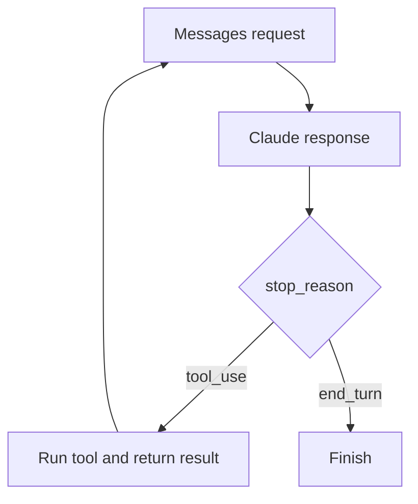
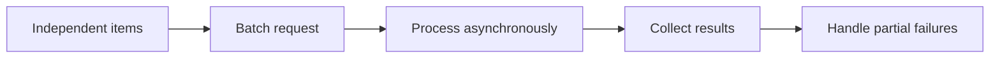
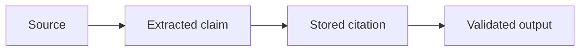

# Cross-Module Topics

This note covers concepts that show up across all modules. These are the "do not confuse X with Y" topics that usually determine whether the rest of the system stays coherent.

## Anti-patterns to avoid

- fixing the wrong mechanism: optimizing symptoms instead of the real constraint.
- optimizing for unstated goals: creates local improvements that miss the actual objective.
- choosing prompt tweaks for structural problems: papering over architecture mistakes.
- confusing Claude Code CLI behavior with API behavior: mixes two distinct operating models.
- confusing tools, resources, and prompts: breaks the contract boundaries.
- using reactive cleanup when preventive isolation exists: more expensive and less reliable.
- treating confidence as correctness: a recurring source of bad automation.

## Pattern tradeoffs

- read constraints first: avoids building the wrong thing.
- eliminate by mechanism: target the root cause, not the symptom.
- choose structural fixes first: usually the highest-leverage move.
- keep the minimum sufficient fix: reduces risk and maintenance burden.
- preserve provenance at ingestion: keeps later validation possible.
- validate before execution when stakes are high: catches bad actions before they matter.
- isolate risky work: keeps failures contained.
- summarize before context overload: protects long-running work from drift.

## Topic notes

### Messages API
- **What it is:** The structured API interface for turn-by-turn Claude conversations.
- **When to use:** Use it when a scenario involves Messages API and asks which mechanism, scope, boundary, or reliability pattern fits.

- **Pros:** Clear contract for turn-by-turn model interaction.
- **Cons:** Easy to misuse if you treat it like raw text chat instead of a structured protocol.

### tool use
- **What it is:** The cross-cutting mechanism where Claude delegates actions or data access to external tools.
- **When to use:** Use it when a scenario involves tool use and asks which mechanism, scope, boundary, or reliability pattern fits.
- **Pros:** Enables the model to call outward capabilities instead of hallucinating them.
- **Cons:** Requires careful control flow or the interaction becomes brittle.

### structured outputs
- **What it is:** Constraining responses into predictable formats that can be parsed, validated, or stored.
- **When to use:** Use it when a program, test, or database needs to consume Claude responses reliably.
- **Pros:** Easier to validate, parse, and reuse across modules.
- **Cons:** Can be too rigid if you force every task into the same shape.

### errors
- **What it is:** Failure signals that must be classified so the system can respond correctly.
- **When to use:** Use it when a scenario involves errors and asks which mechanism, scope, boundary, or reliability pattern fits.
- **Pros:** Explicit errors are the basis for retries, alerts, and fallback logic.
- **Cons:** Too much error noise can obscure the actual fault line.

### rate limits
- **What it is:** Service constraints that limit request volume, token volume, or concurrency.
- **When to use:** Use it when failures involve throughput, quota, overload, retry timing, or backoff.
- **Pros:** Protect system health and keep load manageable.
- **Cons:** Need backoff and queue discipline or they degrade user experience.

### batch processing
- **What it is:** Processing many independent requests or items together for throughput and repeatability.
- **When to use:** Use it when a scenario involves batch processing and asks which mechanism, scope, boundary, or reliability pattern fits.

- **Pros:** Efficient for independent units of work and repeatable pipelines.
- **Cons:** Batch failures can be harder to localize than single-item failures.

### provenance
- **What it is:** The ability to trace claims, facts, or outputs back to their source material.
- **When to use:** Use it when answers need evidence, traceability, auditability, or source-grounded validation.

- **Pros:** Lets you trace where claims and outputs came from.
- **Cons:** Tracking provenance adds bookkeeping overhead.

### prompt injection
- **What it is:** An attack or failure mode where untrusted content tries to override system or developer instructions.
- **When to use:** Use it when a scenario involves prompt injection and asks which mechanism, scope, boundary, or reliability pattern fits.
- **Pros:** Recognizing the threat helps you design safer prompt and tool boundaries.
- **Cons:** Defensive measures that are too aggressive can block legitimate instructions.

### pre-execution validation
- **What it is:** Checking planned actions before running them, especially when tools have side effects.
- **When to use:** Use it when a scenario involves pre-execution validation and asks which mechanism, scope, boundary, or reliability pattern fits.
- **Pros:** Prevents bad actions from running.
- **Cons:** Validation logic can become another complex system if you overbuild it.

### evaluator-optimizer
- **What it is:** A loop where one component evaluates output and another revises it until quality improves.
- **When to use:** Use it when a scenario involves evaluator-optimizer and asks which mechanism, scope, boundary, or reliability pattern fits.
- **Pros:** Good for iterative improvement and quality loops.
- **Cons:** Expensive, and it can overfit to the evaluator instead of the task.

### progressive summarization
- **What it is:** Repeatedly compressing growing context while preserving the state needed for future work.
- **When to use:** Use it when a scenario involves progressive summarization and asks which mechanism, scope, boundary, or reliability pattern fits.
- **Pros:** Preserves important state as context grows.
- **Cons:** Each compression step can drop nuance.

### rolling summaries
- **What it is:** Continuously updated summaries that represent the latest working state of a long session.
- **When to use:** Use it when a scenario involves rolling summaries and asks which mechanism, scope, boundary, or reliability pattern fits.
- **Pros:** Strong for long-lived work where the latest state matters most.
- **Cons:** Summaries need upkeep or they drift away from reality.

### parallel extraction
- **What it is:** Splitting fact gathering across independent branches and merging structured findings.
- **When to use:** Use it when a scenario involves parallel extraction and asks which mechanism, scope, boundary, or reliability pattern fits.
- **Pros:** Fast way to gather facts from large or complex material.
- **Cons:** Merge quality is only as good as the reconciliation step.

### `context: fork`
- **What it is:** A branching mode that isolates a workstream from the parent context while preserving the parent state.
- **When to use:** Use it when related workstreams need isolation but still originate from the same parent task.
- **Pros:** Cleanly separates branches of work while preserving the parent thread.
- **Cons:** Forks create state reconciliation work later.

## Exam pattern

### What the question is usually testing

- Whether you can identify the real mechanism before choosing an answer.
- Whether you can tell when a question is about structure, scope, or environment instead of raw model quality.
- Whether you know to prefer the minimum sufficient fix that matches the constraint.
- Whether you can keep Claude Code CLI, API, and MCP concepts separate.

### What to notice first

- Constraint phrases such as `without`, `must not`, `at the interface level`, `fits in context`, `no human review`, `already failed`, or `guarantee`.
- Environment cues: `CLI`, `API`, `MCP`, `session`, `resume`, `prompt`, `tool`, `resource`.
- Absolute claims that sound nice but do not match the mechanism.

### How to eliminate wrong answers

- Eliminate options that solve a neighbouring problem instead of the stated one.
- Eliminate prompt tweaks when the question is about an architectural or schema-level guarantee.
- Eliminate answers that ignore constraints just because they seem productive.
- Eliminate answers that confuse runtime behavior with configuration or protocol behavior.

### How to answer correctly

- Read constraints first, then identify the broken mechanism, then choose the smallest fix that makes the wrong outcome less likely or impossible.
- Prefer structural fixes over reactive ones when the question asks for robustness.
- Preserve provenance at ingestion when the question involves traceability or evidence.
- Validate before execution when the stakes are high.
- Summarize before context overload so later work stays coherent.

### Common question shapes

- "Which answer survives the constraints?" -> eliminate anything that violates a stated limit first.
- "What is the most robust fix?" -> choose the structural or source-level fix.
- "What environment is this about?" -> CLI, API, or MCP, not all three.
- "Should I optimize for cost/latency?" -> only if the question actually names those as constraints.

### Short answer rule

- Constraint first.
- Mechanism second.
- Structural fix third.
- Prompt-level answer last.